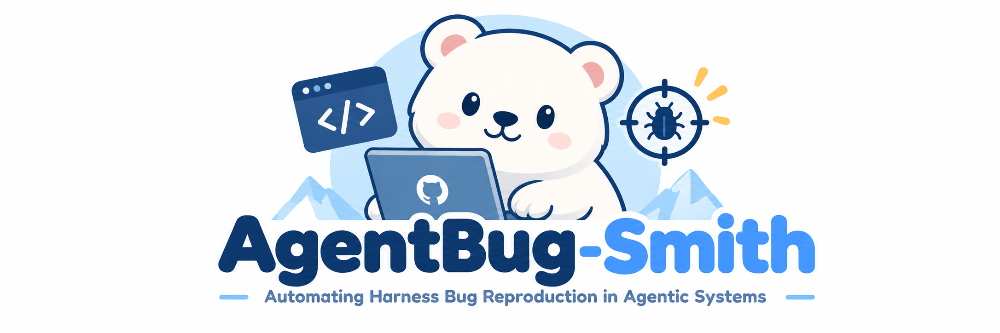
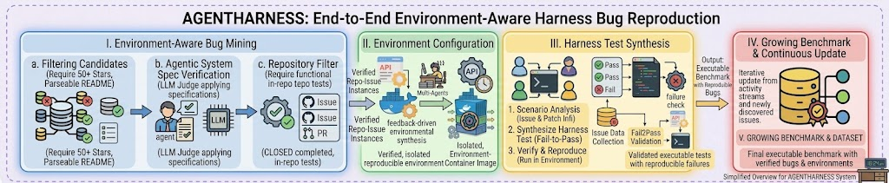
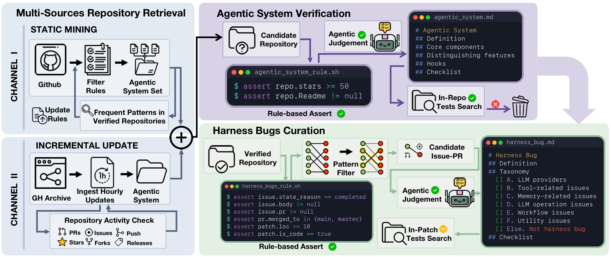
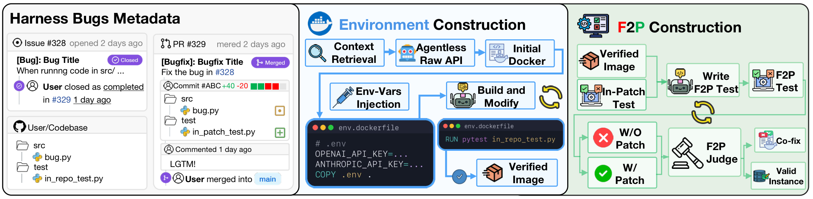
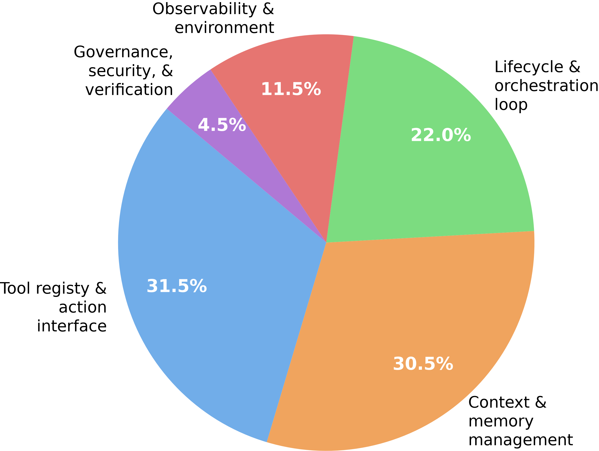
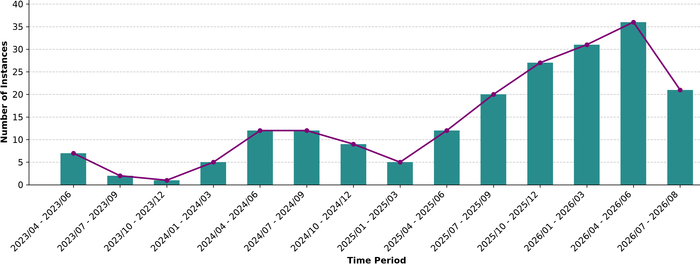

<p align="center">
  
</p>

<p align="center">
  <a href="https://github.com/1123qqa/ICLR2027">Code</a>
  ·
  <a href="https://huggingface.co/buckets/IMICLRAUTHOR/live-harness-bench">Live-Harness Bench</a>
</p>

Modern agents are not only a backbone model. They are a harness: the software that manages context, calls tools, loops until a stop condition, and talks to model providers. That harness is now large enough to have its own bugs, and those bugs are harder to repair than ordinary software defects. Existing software agents resolve harness bugs at a much lower rate than general GitHub issues, and the only previous executable collection of such bugs is small and frozen. Building even that small set took on the order of a hundred hours of manual reproduction.

AgentBug-Smith is an automated way to find these bugs in the wild and turn them into tests. It watches open-source agent repositories, keeps issues whose fixes actually edit the harness, builds a container that can run the repository, and writes a test that fails on the buggy commit and passes after the developer patch. Running that pipeline produces **Live-Harness Bench**, currently 200 executable instances. The benchmark itself is the [Hugging Face bucket](https://huggingface.co/buckets/IMICLRAUTHOR/live-harness-bench). This repository is the pipeline, the logs behind the paper's tables, and the patches produced when we asked existing software agents to fix the same bugs.

The benchmark is meant to keep growing. The same three stages can be pointed at newly reported issues, which is how a harness-bug benchmark stays ahead of whatever the models have already memorized.

## What the system does

<p align="center">
  
</p>

An issue only enters the benchmark if two filters agree. The repository has to look like an agent system, not a tutorial or a paper list: at least 50 stars, tests already in the tree, and the usual agent pieces (planning, tools, memory, orchestration, provider clients). The issue has to be a completed, merged issue–pull-request pair whose patch edits one of those pieces. Utility bugs that would also show up in ordinary software are dropped. On a manually labeled sample this identification step is accurate for 95% of repositories and 92% of issues, and it stays stable when the same issues are classified five times.

<p align="center">
  
</p>

The harder part is execution. Agent code calls models, tools, and network services that are not present in a fresh container, and a failure often appears only in a particular interaction, not as a unit-test assertion that was already in the pull request. AgentBug-Smith therefore builds the environment and the test as two separate artifacts. A rule scan of manifests and CI files proposes the first Dockerfile. A coding agent may revise only that Dockerfile until the image builds and a short in-repository smoke test runs. A second agent then writes a language-native test, or copies a developer test when the patch already contains one. The test is accepted only when it fails on the buggy snapshot and passes after the developer patch is applied. If both loops stall, one co-fix step may edit the Dockerfile and the test together.

<p align="center">
  
</p>

We compared this with SWE-Factory and SWE-bench-Live on the same 225 identified issues and three backbones. AgentBug-Smith reproduces 45 issues with GPT-4.1-mini (20.00%, \$0.56 each), 46 with Kimi-k2.5 (20.44%, \$0.91), and 63 with DeepSeek-v3.2 (28.00%, \$2.44). SWE-Factory reproduces 21, 19, and 31. SWE-bench-Live reproduces 6, 6, and 1. The gap is largest on issues that ship without a developer test: the two baselines produce no fail-to-pass test in that case, and AgentBug-Smith still does. Environment builds succeed for 84, 53, and 93 of the 225 issues under the three models, against at most 44 for either baseline.

Those 225 issues are the comparison pool. The released benchmark is the 200 instances that survived as executable artifacts and are stored on Hugging Face. They come from large projects, averaging 123k lines of code and 479 files. A typical developer patch touches 3.8 files, 19.8 hunks, and 202.9 lines. The bugs are spread across the harness rather than piled into one component: 31.5% tool registry and action interface, 30.5% context and memory, 22.0% lifecycle and orchestration, 11.5% observability and environment, and 4.5% governance, security, and verification. Their report dates run through August 2025.

<p align="center">
  
</p>

<p align="center">
  
</p>

## What current agents can fix

We gave the 200 instances to three software agents and asked them to patch the bug. A patch is plausibly resolved when it passes the failure-triggering test, and correctly resolved when it matches the developer fix.

| Agent | Plausibly resolved | Correctly resolved | File localization | Function localization | Average cost |
| --- | --- | --- | --- | --- | --- |
| mini-SWE-agent | 19.50% | 9.00% | 75.12% | 68.66% | \$0.38 |
| OpenHands | 17.50% | 8.50% | 81.00% | 66.00% | \$0.03 |
| AutoCodeRover | 6.00% | 3.50% | 37.19% | 31.66% | \$0.04 |

Passing the test is not the same as matching the fix. mini-SWE-agent already localizes the right file on most instances and still matches the developer patch on only 9% of them.

The second use of the benchmark is as a memory of real fixes. We split repositories so that no project appears on both sides: 121 issues for training, 79 for test. A text skill distilled from the training issues, and forbidden from naming a repository or a gold patch, is then given to mini-SWE-agent. On the 79 held-out issues, correct resolution moves from 1.27% (1/79) to 7.59% (6/79). Plausibly resolved moves from 35.44% to 41.77%. File localization moves from 79.32% to 92.31%, and function localization from 34.60% to 66.41%. The gain is localization: the skill puts the agent on the right function, after which a small edit can match the developer change.

## How this repository is organized

| Path | What you will find |
| --- | --- |
| `src/`, `exp/`, `prompt/`, `conf/` | Environment construction and fail-to-pass test generation |
| `identification/` | Repository discovery and harness-issue mining |
| `rq1/f2p_by_models/` | Per-issue reproduction logs for every model and both baselines' comparison |
| `rq2/` | Human labels and the five-run stability study for identification |
| `rq4/` | The 121/79 repository split, the distilled skill, and the rollout scores |
| `agent/runners/` | The batch scripts that ask mini-SWE-agent, OpenHands, and AutoCodeRover for a patch |
| `agent/patches/`, `agent/evaluation/` | The patches those agents wrote, and the logs from scoring them |
| `data/issues/` | Issue JSON that was fed into the pipeline |
| `misc/identification/` | Raw dumps from the repository and issue crawl |
| `misc/Agent-Issues.xlsx` | The working spreadsheet, including sheets that never became paper tables |
| `baselines/swe-bench-live/`, `baselines/swe-factory/` | The `baseline/` directory from each comparison fork: launch script, issue maps, and the small helpers those scripts call |
| `assets/` | Figures |

Read three paths carefully before you treat a folder as "the" result:

- Nothing is stored under a name `rq3`. The environment-generation rates and the with-test / without-test counts are measurements on the same runs as `rq1/`.
- `rq1/f2p_by_models/gpt-4.1-mini/` is only the 25, 50, 70, and 80-issue pilots. The GPT run on the 225-issue pool is `rq1/f2p_by_models/extended_gpt_f2p/`. Kimi and DeepSeek for that pool are `kimi-k2.5/` and `deepseek-v3.2/`.
- `data/issues/issues_10` through `issues_80` are those pilots' inputs. Folders named `issues_<repository>/` are per-project dumps. Neither is the released 200. The released set is `benchmark/` on Hugging Face.

## Running the experiments

Python 3.10 or newer, Docker, a GitHub token, and an OpenAI-compatible API. The runs in the paper used Forge (`https://api.forge.tensorblock.co/v1`) as that API.

```bash
python -m venv .venv
source .venv/bin/activate
pip install -r requirements.txt
cp .env.example .env
```

Put a real key in `FORGE_API_KEY` and `OPENAI_API_KEY`, and a GitHub token in `GITHUB_TOKEN`. `MODEL` is the backbone. The paper's default is `tensorblock/gpt-4.1-mini`.

### Build instances

`exp/end-end.py` reproduces one issue. It does not read a path from the command line. Change `_ISSUE_JSON` near the top of the file. The default `data/issues/issue_2805.json` is not in this tree; use a file that is, such as `data/issues/issues_80/issue_177.json`.

```bash
python exp/end-end.py
```

A batch is a JSON manifest of paths relative to the repository root. `exp/batch_end_end.py` points `end-end.py` at each path in turn.

```json
{"issues": ["data/issues/issues_80/issue_177.json"]}
```

```bash
python exp/batch_end_end.py manifest.json --continue-on-error
```

Each issue writes `result/<issue>_<utc>/`: `env.dockerfile`, the generated test, `generated_patch.diff` (the developer patch), `summary.json`, `dockerbuild.txt`, `f2p.txt`, and `run.log`. Docker has to be running, and the script clones the upstream repository named in the issue JSON. The 200 directories on Hugging Face are these artifacts after selection.

### Identification

Stage 1 is `identification/`, and it is a sequence of scripts rather than one entry point. Run them from the repository root, with the same `.env`.

```bash
python identification/repo-hook/github/main.py
python identification/repo-hook/github_archive/main.py
python identification/issue-hook/issue_crawler.py
```

The last filter, which decides whether a surviving issue is a harness bug, is `identification/pipeline/issue-filtering/`. The READMEs inside `identification/` still mention absolute paths from the machine that ran the crawl (`/home/cc`, `/home/fdse`). Ignore those paths and use the commands above.

The labels used for the 95% / 92% accuracy numbers, and the five repeated classifications, are in `rq2/`. `python rq2/run_all.py` reruns the stability comparison. It expects the issue–pull-request list in `rq2/issue_pr_map.json`.

### SWE-Factory and SWE-bench-Live

Both baselines were applied to the same 225 issues. We did not vendor either project. `baselines/swe-factory/` and `baselines/swe-bench-live/` are the `baseline/` directories from the checkouts we actually ran: the launch script, the issue maps at 10/25/50/70/80 and at the full pool, and the small Python helpers the launch script calls. The rest of each system is upstream.

To rerun SWE-bench-Live, clone that project, copy `baselines/swe-bench-live/` over its `baseline/` directory, and from the clone root run:

```bash
bash baseline/run_RQ1_sbl.sh
```

SWE-Factory is the same pattern:

```bash
bash baseline/run_RQ1_swe-factory.sh baseline/issue_pr_map.json
```

Both scripts still contain that machine's conda prefix and checkout path. Edit those before expecting them to run anywhere else. `issue_pr_map.json` is the full pool. `issue_pr_map_80.json` and the smaller maps are the pilots.

### Ask a software agent for a patch

The three runners are copied into `agent/runners/`. They are the `exp/run_*_batch.py` files from the agent checkouts, and they import that agent's own package. Run each script from a checkout of the corresponding project, with `--artifacts-dir` pointed at a directory of benchmark instances (one subdirectory per issue, as on Hugging Face).

mini-SWE-agent, from a checkout of that project:

```bash
python exp/run_mini_swe_agent_batch.py \
  --artifacts-dir /path/to/benchmark \
  --output-dir /path/to/patches \
  --model "openai/tuzi-deepseek-v3.2/deepseek-v3.2"
```

OpenHands:

```bash
python exp/run_openhands_batch.py \
  --artifacts-dir /path/to/benchmark \
  --output-dir /path/to/patches \
  --model openai/tuzi-gpt-4.1-mini/deepseek-v3.2 \
  --max-iterations 60
```

AutoCodeRover needs its own repository root as well:

```bash
python exp/run_acr_batch.py \
  --artifacts-dir /path/to/benchmark \
  --output-dir /path/to/patches \
  --acr-root /path/to/auto-code-rover \
  --model gpt-4o-mini-2024-07-18
```

The patches from the paper are already in `agent/patches/`. Each agent has its own subdirectory, and each issue directory contains `generated_patch.diff` plus the agent's own logs.

### Score those patches

`exp/evaluate_f2p.py` rebuilds the instance and runs the failure-triggering test. `--artifacts-dir` is a folder whose children are instances, either a download of the Hugging Face `benchmark/` prefix or a local `result/` tree.

Score the developer patch stored in the issue JSON:

```bash
python exp/evaluate_f2p.py \
  --artifacts-dir /path/to/benchmark \
  --output-dir /tmp/f2p_eval \
  --patch-mode issue_json
```

Score an agent. The evaluator looks for `result_<instance-name>/generated_patch.diff` under `--custom-patches-dir`, which is the layout of `agent/patches/<agent>/`:

```bash
python exp/evaluate_f2p.py \
  --artifacts-dir /path/to/benchmark \
  --output-dir /tmp/f2p_eval \
  --patch-mode generated_diff \
  --custom-patches-dir agent/patches/mini-swe-agent-patches
```

The paper's scores for the three agents are the logs in `agent/evaluation/`. The skill experiment, including the frozen `SKILL.md` and the 121/79 split, is `rq4/`.
