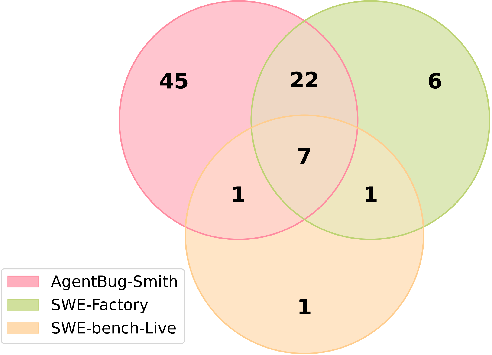

<p align="center">
  
</p>

<p align="center">
  <a href="https://github.com/1123qqa/ICLR2027">Code</a>
  ·
  <a href="https://huggingface.co/buckets/IMICLRAUTHOR/live-harness-bench">Benchmark (200 instances)</a>
</p>

AgentBug-Smith reproduces real-world harness bugs from open-source agent systems and builds **Live-Harness Bench**, a set of 200 executable instances. Each instance has an issue, a container environment, a failure-triggering test, and the developer patch.

The Hugging Face bucket stores only that benchmark. This repository stores the pipeline code and the other experiment records.

## Pipeline

Harness-bug identification retrieves agent repositories and keeps issues whose patches touch a harness component.

<p align="center">
  
</p>

<p align="center">
  
</p>

Environment construction and failure-triggering test generation then turn each issue into a fail-to-pass instance.

<p align="center">
  
</p>

## Benchmark

Live-Harness Bench covers harness components across a wide reporting window. The 200 executable instances are on Hugging Face, under `benchmark/`.

<p align="center">
  
</p>

<p align="center">
  
</p>

On the shared set of 225 harness issues, reproduction success is 45/225 with GPT-4.1-mini, 46/225 with Kimi-k2.5, and 63/225 with DeepSeek-v3.2. The overlap with SWE-Factory and SWE-bench-Live is below.

<p align="center">
  
</p>

## Layout

| Path | Contents |
| --- | --- |
| `src/`, `exp/`, `prompt/`, `conf/` | Environment construction and failure-triggering test generation |
| `identification/` | Repository and issue retrieval (stage 1) |
| `rq1/f2p_by_models/` | Reproduction logs for GPT-4.1-mini, Kimi-k2.5, DeepSeek-v3.2, and the extended GPT run, including the 25/50/70/80 snapshots |
| `rq2/` | Identification labels and stability runs |
| `rq4/` | Skill distillation: repository-disjoint split, skills, and rollouts |
| `agent/patches/`, `agent/evaluation/` | Patches and evaluation logs from mini-SWE-agent, OpenHands, and AutoCodeRover |
| `data/issues/` | Issue JSON used as pipeline input, including the size snapshots |
| `misc/identification/` | Raw repository and issue collection dumps |
| `misc/Agent-Issues.xlsx` | Working spreadsheet, including sheets that are not in the paper tables |
| `baselines/` | Launch scripts used to run SWE-bench-Live and SWE-Factory |
| `assets/` | Figures |

RQ3 does not have a separate run. Environment-generation and test-generation numbers are computed from the same logs as `rq1/`.

## Run the reproduction pipeline

```bash
python -m venv .venv
source .venv/bin/activate
pip install -r requirements.txt
cp .env.example .env
python exp/end-end.py
```

`exp/end-end.py` reads the issue JSON configured in that file, builds a Docker image, generates a test, and checks fail-to-pass. `exp/evaluate_f2p.py` scores a produced patch. Fill `.env` from `.env.example` before running. Docker is required.

Stage 1 lives in `identification/` (`repo-hook`, `issue-hook`, and `pipeline/issue-filtering`).

## Baselines and agent runners

SWE-Factory and SWE-bench-Live were run from their upstream repositories. `baselines/run_RQ1_swe-factory.sh` and `baselines/run_RQ1_sbl.sh` are the launch scripts. Paths inside those scripts point at the machine used for the experiments.

mini-SWE-agent, OpenHands, and AutoCodeRover were run from their upstream repositories. The patches they produced are in `agent/patches/`, and the scoring logs are in `agent/evaluation/`.

## Benchmark files

Each directory in the Hugging Face bucket under `benchmark/` is one instance. Typical files:

| File | Role |
| --- | --- |
| `issue_*.json` | Issue text, linked pull request, and commits |
| `env.dockerfile` | Container environment |
| `agentsmith_fail2pass_*.py` | Failure-triggering test |
| `generated_patch.diff` | Developer patch |
| `summary.json` | Fail-to-pass outcome |
| `dockerbuild.txt`, `f2p.txt`, `run.log` | Build and verification logs |
