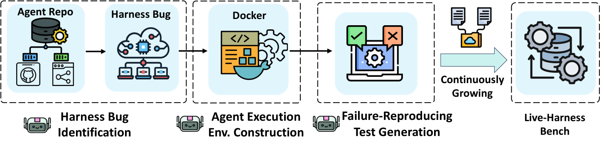
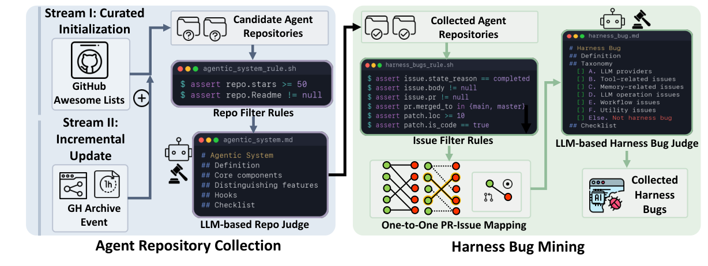
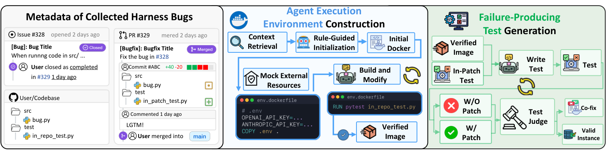

<p align="center">
  
</p>

<p align="center">
  <a href="https://github.com/1123qqa/ICLR2027"></a>
  <a href="https://huggingface.co/buckets/IMICLRAUTHOR/live-harness-bench"></a>
</p>

Code and experiment records for AgentBug-Smith and Live-Harness Bench.

The 200 executable instances are a file benchmark: [Live-Harness Bench](https://huggingface.co/buckets/IMICLRAUTHOR/live-harness-bench). This repository is the harness that builds those instances and the logs behind the paper's tables.

## News

- The comparison logs for reproduction, identification, and skill distillation now live under `rq/`.
- Live-Harness Bench (200 instances) is published as a bucket. Each directory is one issue with a Dockerfile, a fail-to-pass test, and the developer patch.

## Overview

An agent is a backbone model plus a harness: context, tools, the control loop, and the client that talks to a model provider. That harness is large enough to have its own bugs, and current software agents repair those bugs much less often than ordinary GitHub issues. The only earlier executable collection of harness bugs is small and fixed, and assembling it took on the order of a hundred hours.

AgentBug-Smith finds these bugs in open-source agent repositories and turns each one into a test. It keeps a repository only when it has at least 50 stars, already contains tests, and matches an agent structure. It keeps an issue only when the issue and its merged pull request form one pair and the patch edits the harness rather than an ordinary utility. On a labeled sample this filter is right for 95% of repositories and 92% of issues. A second stage builds a container. A third stage writes a test that fails on the buggy commit and passes after the developer patch. Issues that ship with no developer test are the case general reproduction systems miss. AgentBug-Smith still produces a fail-to-pass test there.

The released result is **Live-Harness Bench**, 200 instances from repositories that average 123k lines of code. A gold patch changes 3.8 files and 202.9 lines on average. The bugs cover tool registries (31.5%), context and memory (30.5%), lifecycle and orchestration (22.0%), observability (11.5%), and governance (4.5%), and they include reports from as late as August 2025.

<a id="fig-e2e"></a>
<p align="center">
  <a href="#fig-e2e"></a>
  <a href="assets/figures/e2e-old.md"></a>
</p>
<p align="center">
  
</p>

On one shared pool of 225 identified issues, AgentBug-Smith reproduces 45 with GPT-4.1-mini, 46 with Kimi-k2.5, and 63 with DeepSeek-v3.2. SWE-Factory reproduces 21, 19, and 31 of those issues. SWE-bench-Live reproduces 6, 6, and 1. The 200 instances on Hugging Face are the executable benchmark. The 225-issue pool is the comparison, and its logs are `rq/rq1/`.

Asked to fix the benchmark, mini-SWE-agent, OpenHands, and AutoCodeRover correctly match the developer patch on 9.00%, 8.50%, and 3.50% of instances. A skill distilled from 121 issues, with whole repositories held out, raises mini-SWE-agent from 1.27% to 7.59% correct on the remaining 79.

<a id="fig-e2e-p2"></a>
<p align="center">
  <a href="#fig-e2e-p2"></a>
  <a href="assets/figures/e2e-p2-old.md"></a>
</p>
<p align="center">
  
</p>

<a id="fig-e2e-p3"></a>
<p align="center">
  <a href="#fig-e2e-p3"></a>
  <a href="assets/figures/e2e-p3-old.md"></a>
</p>
<p align="center">
  
</p>

<p align="center">
  
</p>

<p align="center">
  
</p>

## Set up

Python 3.10 or newer, Docker, a GitHub token, and an OpenAI-compatible endpoint. The paper used Forge.

```bash
git clone https://github.com/1123qqa/ICLR2027.git
cd ICLR2027
python -m venv .venv
source .venv/bin/activate
pip install -r requirements.txt
cp .env.example .env
```

Fill `FORGE_API_KEY`, `OPENAI_API_KEY`, and `GITHUB_TOKEN`. `MODEL` defaults to `tensorblock/gpt-4.1-mini`.

Download the benchmark from the bucket prefix `benchmark/`. Every child directory is one instance.

## Usage

`exp/end-end.py` reproduces a single issue. It does not take a path argument. Set `_ISSUE_JSON` near the top of the file to a JSON that exists in this tree, then run it. The checked-in default, `data/issues/issue_2805.json`, is not a file here.

```bash
python exp/end-end.py
```

A batch reads a manifest of paths relative to the repository root:

```bash
python exp/batch_end_end.py manifest.json --continue-on-error
```

```json
{"issues": ["data/issues/issues_80/issue_177.json"]}
```

Score the developer patch, or an agent patch. `--artifacts-dir` is a folder of instances. Agent patches are resolved as `result_<instance>/generated_patch.diff` under `--custom-patches-dir`.

```bash
python exp/evaluate_f2p.py \
  --artifacts-dir /path/to/benchmark \
  --output-dir /tmp/f2p_eval \
  --patch-mode issue_json

python exp/evaluate_f2p.py \
  --artifacts-dir /path/to/benchmark \
  --output-dir /tmp/f2p_eval \
  --patch-mode generated_diff \
  --custom-patches-dir agent/patches/mini-swe-agent-patches
```

Identification is three scripts plus a filter, run from the repository root:

```bash
python identification/repo-hook/github/main.py
python identification/repo-hook/github_archive/main.py
python identification/issue-hook/issue_crawler.py
```

The harness judge is `identification/pipeline/issue-filtering/`. Repeat the stability study with `python rq/rq2/run_all.py`.

The agent runners in `agent/runners/` are copied from the agent checkouts and import those projects. Run them there, not from this folder.

```bash
python exp/run_mini_swe_agent_batch.py \
  --artifacts-dir /path/to/benchmark \
  --output-dir /path/to/patches \
  --model "openai/tuzi-deepseek-v3.2/deepseek-v3.2"

python exp/run_openhands_batch.py \
  --artifacts-dir /path/to/benchmark \
  --output-dir /path/to/patches \
  --model openai/tuzi-gpt-4.1-mini/deepseek-v3.2 \
  --max-iterations 60

python exp/run_acr_batch.py \
  --artifacts-dir /path/to/benchmark \
  --output-dir /path/to/patches \
  --acr-root /path/to/auto-code-rover \
  --model gpt-4o-mini-2024-07-18
```

SWE-Factory and SWE-bench-Live stay upstream. `baselines/swe-factory/` and `baselines/swe-bench-live/` are the `baseline/` directories from the checkouts used in the paper. Copy a directory onto a clone of that project and run `bash baseline/run_RQ1_swe-factory.sh baseline/issue_pr_map.json` or `bash baseline/run_RQ1_sbl.sh`. `issue_pr_map.json` is the 225-issue pool. The numbered maps are the pilots.

## Downloads

| Record | Where |
| --- | --- |
| Live-Harness Bench, 200 instances | [bucket `benchmark/`](https://huggingface.co/buckets/IMICLRAUTHOR/live-harness-bench) |
| Reproduction logs (RQ1, and the RQ3 counts taken from the same runs) | `rq/rq1/f2p_by_models/` |
| Identification labels and stability (RQ2) | `rq/rq2/` |
| Skill split, skill file, rollouts (RQ4) | `rq/rq4/` |
| Agent patches and their evaluation logs | `agent/patches/`, `agent/evaluation/` |

`rq/rq1/f2p_by_models/gpt-4.1-mini/` holds only the 25/50/70/80 pilots. The GPT run on the full comparison pool is `rq/rq1/f2p_by_models/extended_gpt_f2p/`. There is no `rq/rq3/` directory.

## Layout

| Path | Contents |
| --- | --- |
| `src/`, `exp/`, `prompt/`, `conf/` | Environment construction and test generation |
| `identification/` | Repository and issue mining |
| `rq/` | `rq1` reproduction logs, `rq2` identification study, `rq4` skill experiment |
| `agent/` | Runner scripts, patches, evaluation logs |
| `data/issues/` | Pipeline inputs, including size snapshots and per-repository dumps |
| `baselines/` | Baseline launch directories for SWE-Factory and SWE-bench-Live |
| `misc/` | Raw crawl dumps and the working spreadsheet |
| `assets/` | Figures |

## Citation

```bibtex
@misc{agentbugsmith2026,
  title={AgentBug-Smith: Automatically Reproducing Harness Bugs in Agentic Systems},
  year={2026},
  url={https://github.com/1123qqa/ICLR2027}
}
```

